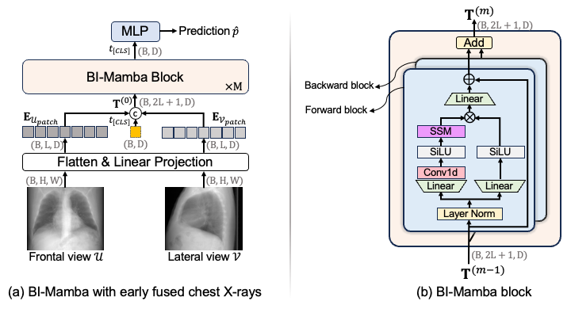

# BI-Mamba

## Abstract

We propose **Bidirectional Image Mamba (BI-Mamba)** to complement unidirectional SSMs with opposite-directional information. BI-Mamba utilizes parallel forward and backward blocks to encode long-range dependencies of multi-view chest X-rays. We conducted extensive experiments on images from 10,395 subjects in the National Lung Screening Trial (NLST). Results show that BI-Mamba outperforms ResNet-50 and ViT-S with comparable parameter size, and saves significant GPU memory during training. BI-Mamba also achieves promising performance compared with previous state of the art in CT, unraveling the potential of chest X-rays for CVD risk prediction.

Our paper was **early accepted at MICCAI 2024 (oral presentation)**: [arxiv.org/pdf/2405.18533](https://arxiv.org/pdf/2405.18533)



## Requirements

```bash
cd /path/to/BI-Mamba
pip install -r ./vim/vim_requirements.txt
```

> **Note:** Installing the Mamba SSM kernel requires a CUDA-enabled GPU. On Google Colab, use:
> ```bash
> SKIP_CUDA_BUILD=True pip install git+https://github.com/state-spaces/mamba.git
> ```

## Training and Evaluation

The ImageNet pretrained checkpoint **`vim_s_midclstok_ft_81p6acc.pth`** used to initialize the BI-Mamba backbone is available [here](https://huggingface.co/hustvl/Vim-small-midclstok/tree/main). Special thanks to [Vim](https://github.com/hustvl/Vim) for their open-source code and checkpoints.

**Finetuning from checkpoint (recommended):**
```bash
bash ./mamba-cxr/scripts/ft-vim-s.sh
```

**Evaluation:**
```bash
bash ./mamba-cxr/scripts/eval-vim-s.sh
```

**Training from scratch:**
```bash
bash ./mamba-cxr/scripts/pt-vim-s.sh
```

## Google Colab Demo

A step-by-step notebook is provided to reproduce the pipeline on Google Colab without access to the NLST dataset. It uses **ChestMNIST** as a publicly available proxy for multi-view chest X-rays, covering installation, data preparation, fine-tuning, evaluation, and prediction visualization.

[](YOUR_COLAB_LINK_HERE)

## Citation

```bibtex
@inproceedings{yang2024cardiovascular,
  title={Cardiovascular disease detection from multi-view chest x-rays with bi-mamba},
  author={Yang, Zefan and Zhang, Jiajin and Wang, Ge and Kalra, Mannudeep K and Yan, Pingkun},
  booktitle={International Conference on Medical Image Computing and Computer-Assisted Intervention},
  pages={134--144},
  year={2024},
  organization={Springer}
}
```
